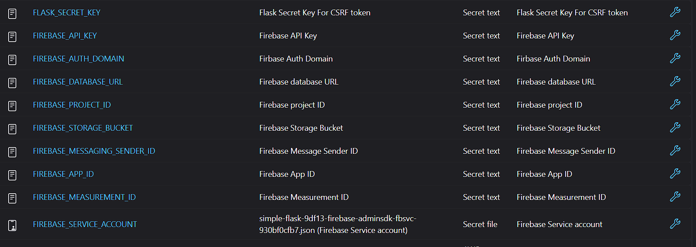

# simple-flask-firebase-jenkins-pipeline

This project is a simple Python web application using Flask and Firebase. It supports user registration, login, and a dashboard, with authentication managed by Firebase. The project includes automated tests and a Jenkins pipeline for CI/CD.

## Features
- User registration and login (Firebase Authentication)
- Dashboard showing registered users
- Pytest-based test suite
- Jenkins pipeline for automated build, test, and deployment

## Project Structure
- `app.py` - Main Flask application
- `requirements.txt` - Python dependencies
- `templates/` - HTML templates (base, login, register, dashboard)
- `static/` - Static files (CSS)
- `tests/` - Test files for the application
- `Jenkinsfile` - Jenkins pipeline configuration

## Setup
1. Clone the repository.
2. Install Python 3 and pip if not already installed.
3. Install dependencies:
	```
	pip install -r requirements.txt
	```
4. Set up Firebase:
	- Go to [Firebase Console](https://console.firebase.google.com/) and create a new project.
	- In the project settings, add a new web app to get your Firebase configuration values (API key, Auth domain, etc.).
	- Enable Email/Password authentication in the Authentication section.
	- Go to Project Settings > Service Accounts, and generate a new private key. Download the JSON file and save it in your project directory.
	- Note the values for API key, Auth domain, Database URL, Project ID, Storage Bucket, Messaging Sender ID, App ID, and Measurement ID from your Firebase project settings.
5. Create a `.env` file with your Firebase and Flask configuration:
	```
	FLASK_SECRET_KEY=your_secret_key
	FIREBASE_API_KEY=your_firebase_api_key
	FIREBASE_AUTH_DOMAIN=your_firebase_auth_domain
	FIREBASE_DATABASE_URL=your_firebase_database_url
	FIREBASE_PROJECT_ID=your_firebase_project_id
	FIREBASE_STORAGE_BUCKET=your_firebase_storage_bucket
	FIREBASE_MESSAGING_SENDER_ID=your_firebase_messaging_sender_id
	FIREBASE_APP_ID=your_firebase_app_id
	FIREBASE_MEASUREMENT_ID=your_firebase_measurement_id
	FIREBASE_SERVICE_ACCOUNT=path_to_your_service_account.json
	```
6. Run the application:
	```
	python app.py
	```
7. Open your browser and go to `http://localhost:5005`.

## Running Tests
To run the tests, use:
```
pytest tests/test_app.py
```

## Jenkins Pipeline
The Jenkins pipeline (`Jenkinsfile`) will:
- Set up the Python environment
- Run tests with pytest
- Deploy the Flask app
- Send email notifications on build success or failure

### Jenkins Linux Shell Commands

These are typical shell commands used in the Jenkins pipeline on a Linux agent:

```sh
# Set up Python virtual environment
python3 -m venv flask-firebase-app
. flask-firebase-app/bin/activate
pip install -r requirements.txt
pip install --upgrade pip setuptools

# Run tests
pytest --maxfail=1 --disable-warnings -q tests/test_app.py

# Run Flask app in background
nohup python app.py &

# Kill process on port 5005 (if needed)
lsof -ti:5005 | xargs kill -9
```

## Screenshot
`screenshots/` folder and reference it below:

- Jenkins pipeline overview   
        
- Jenkins credentials     
    
- Jenkins pipeline alert   
    


## Notes
- Keep your Firebase credentials secure and do not commit sensitive information to version control.
- Update the Jenkinsfile as needed for your environment and notification preferences.

# GitHub Actions CI/CD
GitHub Actions CI/CD pipeline for automated build, test, and deployment.

CI/CD – GitHub Actions workflow triggered on pushes to the `staging` branch.

- `.github/workflows/staging.yml`

```
# Intentation must be follow while typing
name: Python flask with firebase CI/CD Pipeline

on:
    push:
        branches:
            - staging  # Set branch name

jobs:
    build:
        runs-on: ubuntu-latest  # GitHub Actions Runner Images
        steps:
            - name: Checkout code on runner machine
              uses: actions/checkout@v4  # It will chekout you repository under workplace


            - name: Setup Environment
              uses: actions/setup-python@v4
              with:
                python-version: '3.8'  # Set your python version

            - name: Write Firebase service account key to file
              run: echo '${{ secrets.FIREBASE_SERVICE_ACCOUNT }}' > serviceAccountKey.json


            - name: Install dependencies and Run the application
              env:
                FLASK_SECRET_KEY: ${{ secrets.FLASK_SECRET_KEY }}
                FIREBASE_API_KEY: ${{ secrets.FIREBASE_API_KEY }}
                FIREBASE_AUTH_DOMAIN: ${{ secrets.FIREBASE_AUTH_DOMAIN }}
                FIREBASE_DATABASE_URL: ${{ secrets.FIREBASE_DATABASE_URL }}
                FIREBASE_PROJECT_ID: ${{ secrets.FIREBASE_PROJECT_ID }}
                FIREBASE_STORAGE_BUCKET: ${{ secrets.FIREBASE_STORAGE_BUCKET }}
                FIREBASE_MESSAGING_SENDER_ID: ${{ secrets.FIREBASE_MESSAGING_SENDER_ID }}
                FIREBASE_APP_ID: ${{ secrets.FIREBASE_APP_ID }}
                FIREBASE_MEASUREMENT_ID: ${{ secrets.FIREBASE_MEASUREMENT_ID }}
                FIREBASE_SERVICE_ACCOUNT: serviceAccountKey.json

              run: |
                pip install -r requirements.txt
                pip install --upgrade pip
                pytest tests/test_app.py -v --tb=short
                python app.py & # Run the application in the background
                

```
## Screenshot
- GitHub Action workflow    
    
- GitHub Action Secret    
    
